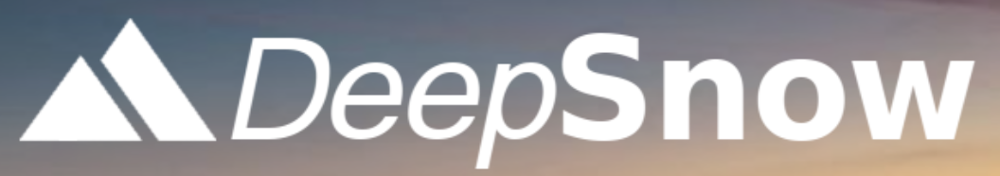
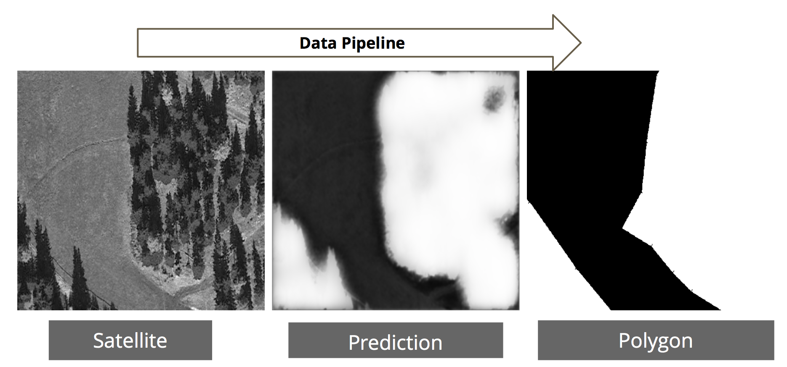

## Intro

DeepSnow is the winning project for the challenge provided by TechnoAlp for the
Hackaton [Hack the alps](https://www.hackthealps.it). We were asked to detect a
ski slope by analyzing a satellite image.

## Solution
We gathered data from various sources, such as: NASA, OpenStreetMaps, OpenSnowMap,
OpenData. Then, we used a deep learning framework called U-net, using Keras.
After that, we used opencv to create a polygon to calculate the area of the slope.
We created a simple web-page using React as front-end, where the user can click
on what he thinks is a slope: the screenshot of the surrounding area is sent to
the back-end (made with Flask) to be analyzed. The output is visible on the map,
with the polygon being drawn in the area that was screenshotted. Below you can
see an example of the process:

## Technology used
Keras, Opencv, React and Flask.

## Credits

@niklaskappler, @thomasverelst, @agemcipe
